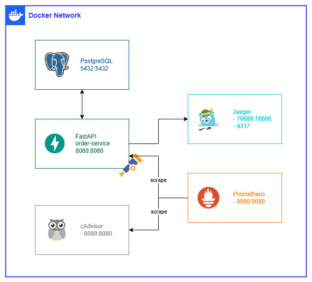

## About The Project


This is a small project about integrating OpenTelemetry to export metrics, logs, and traces from a FastAPI application. Since it is only a demo, the source code does not follow any specific standards or conventions and is intended for reference purposes only.

To get started, the only requirement is Docker (since everything is packaged with Docker Compose) – simple and fast, as it's not intended for production deployment. However, you can refer to the setup to apply it to your own projects.

### Built With

* [![Docker][Docker]][Docker-url]
* [![OpenTelemetry][OpenTelemetry]][OpenTelemetry-url]
* [![Python][Python]][Python-url]
* [![PostgreSQL][PostgreSQL]][PostgreSQL-url]
* [![Jaeger][Jaeger]][Jaeger-url]


## Getting Started

### Architecture



### Prerequisites
* Docker
  ```sh
  docker -v
  ```

* Docker Compose
  ```sh
  docker compose version
  ```

### Installation
1. Clone the repository
  ```sh
  git clone https://github.com/xuhpppp/python-opentelemetry.git
  ```
2. Change directory into the repository source code folder
  ```sh
  cd python-opentelemetry
  ```
3. Setup .env for your environment
  ```sh
  cp .env.example .env
  nano .env
  ```
4. Run docker compose up to start the application
  ```sh
  docker compose up -d
  ```

### How to use
The FastAPI backend will serve as an Order Service for the system and expose the following API endpoint:
http://localhost:8080/orders/{id}

(For now, the database only contains {id} values 1 and 2)

You can access the Jaeger UI through this URL: http://localhost:16686


<!-- MARKDOWN LINKS & IMAGES -->
[Docker]: https://img.shields.io/badge/Docker-2496ED?style=for-the-badge&logo=docker&logoColor=ffffff
[Docker-url]: https://www.docker.com/
[Python]: https://img.shields.io/badge/Python-3776AB?style=for-the-badge&logo=python&logoColor=ffffff
[Python-url]: https://www.python.org/
[OpenTelemetry]: https://img.shields.io/badge/OpenTelemetry-000000?style=for-the-badge&logo=opentelemetry&logoColor=ffffff
[OpenTelemetry-url]: https://opentelemetry.io/
[PostgreSQL]: https://img.shields.io/badge/PostgreSQL-4169E1?style=for-the-badge&logo=postgresql&logoColor=ffffff
[PostgreSQL-url]: https://www.postgresql.org/
[Jaeger]: https://img.shields.io/badge/Jaeger-66CFE3?style=for-the-badge&logo=jaeger&logoColor=ffffff
[Jaeger-url]: https://www.jaegertracing.io/